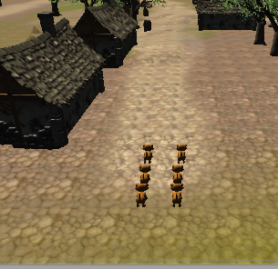

# GroupAnimation
A group animation implemented by Unity3D

## Project Description
This project is based on autonomous agent's behaviors and Unity 3D Engine to build a simple group behavior scene and a Steering Behaviors Library. Each independent agent in the “world,” could perceive the influential factors from the environment, hehave proper actions, and make responses to the “world.” The actions that agents take according to the different conditions and internal regulation is called “Character Animation.” Based on these, the Steering Behaviors Library could directly reflect the movement of group behaviors in different conditions, and provide a simple interface for their combination, too. The ultimate goal of this project is to achieve a multi-role group behavior animation, using the Steering Behaviors Library.  Finally, I choose a typical scene to make it tested and verified.

## Project Demonstration

Youtube： https://youtu.be/Te3ljpninPs

